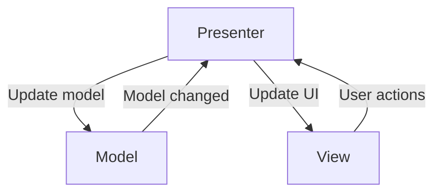
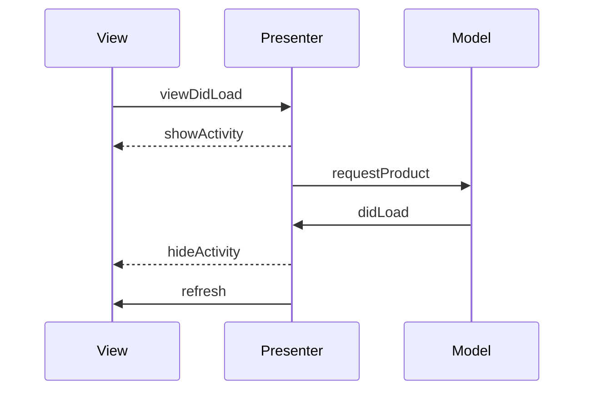
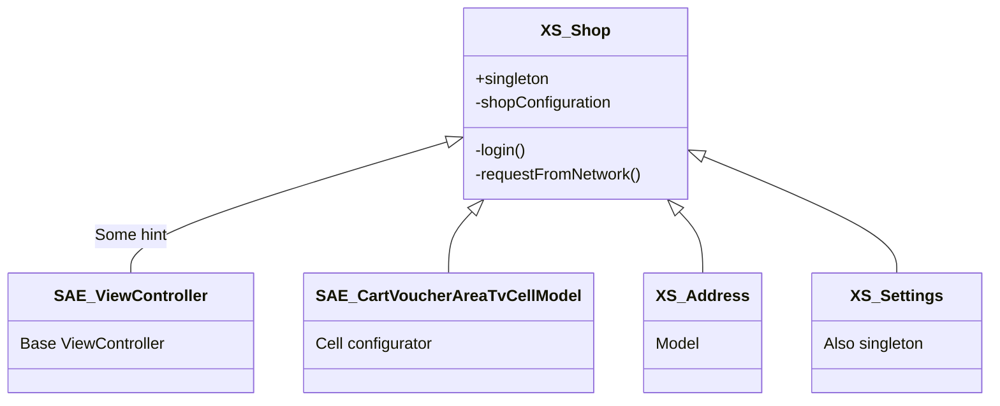

Live editor - https://mermaid-js.github.io/mermaid-live-editor/edit

https://wiki.shop-apotheke.com/display/MAPPD/MVP+-+Model+View+Presenter



<details>
  <summary>Code</summary>
 
  ```
  graph TD
    A[Presenter] -->|Update model| C[Model]
    C -->|Model changed| A
    B[View] -->|User actions| A
    A -->|Update UI| B
  ```
  
</details>



<details>
  <summary>Code</summary>
 
  ```
  sequenceDiagram
    participant View
    participant Presenter
    participant Model

    View->>Presenter: viewDidLoad
    Presenter-->>View: showActivity
    Presenter->>Model: requestProduct
    Model->>Presenter: didLoad
    Presenter-->>View: hideActivity
    Presenter->>View: refresh
  ```
  
</details>

https://wiki.shop-apotheke.com/display/MAPPD/iOS+Singletons+Refactoring



<details>
  <summary>Code</summary>
 
  ```
classDiagram
    XS_Shop <|-- SAE_ViewController : Some hint
    XS_Shop <|-- SAE_CartVoucherAreaTvCellModel
    XS_Shop <|-- XS_Address
    XS_Shop <|-- XS_Settings
    XS_Shop : +singleton
    XS_Shop : -shopConfiguration
    XS_Shop: -login()
    XS_Shop: -requestFromNetwork()

    class SAE_ViewController {
      Base ViewController
    }

    class SAE_CartVoucherAreaTvCellModel {
      Cell configurator
    }
    
    class XS_Address {
      Model
    }

    class XS_Settings {
      Also singleton
    }
  ```
  
</details>
